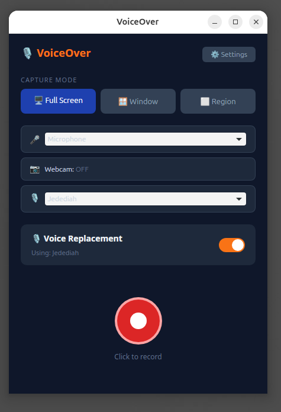
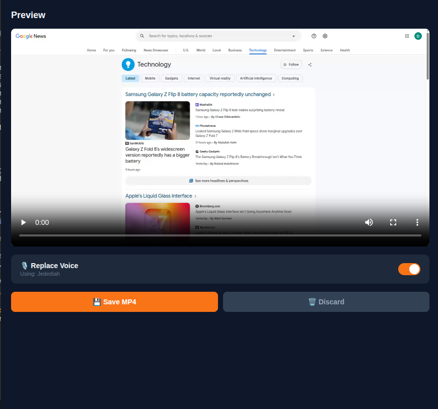
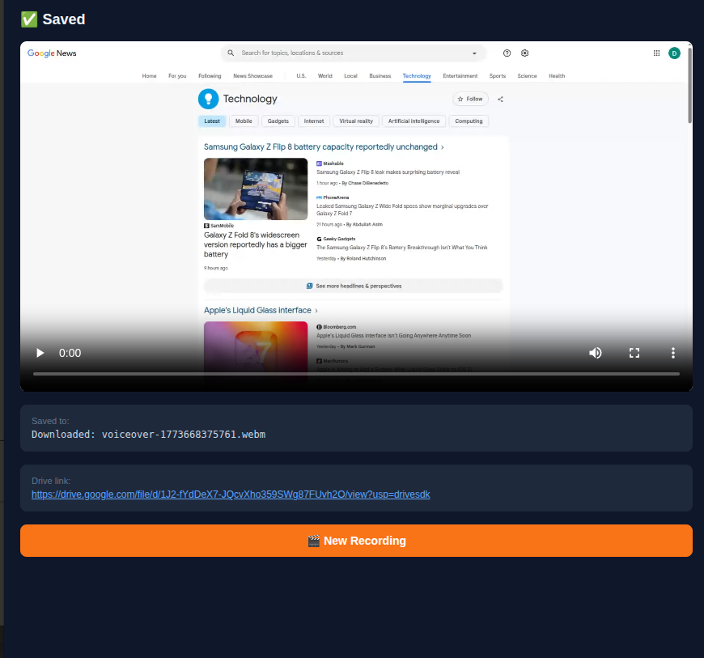
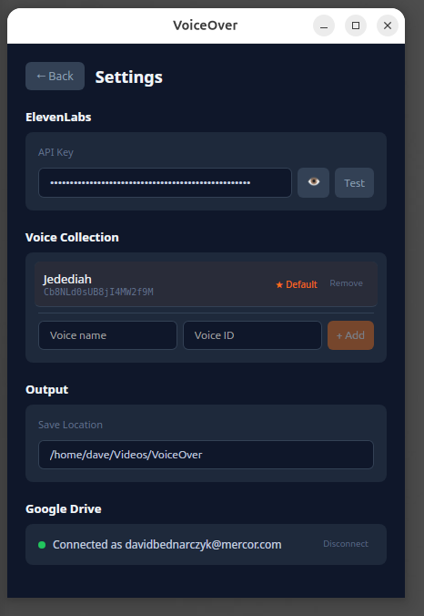

# VoiceOver

A lightweight desktop screen recorder that replaces your voice with an ElevenLabs character voice — record, transform, and export in a single workflow.

Built with Tauri v2 (Rust backend) and SvelteKit 5 (TypeScript frontend). Runs on macOS and Linux.



## What It Does

VoiceOver eliminates the multi-step process of recording a screen capture, uploading audio to ElevenLabs, and manually splicing the result. Instead:

1. **Record** your screen (full screen, window, or region) with microphone audio
2. **Transform** your voice to any ElevenLabs character using Speech-to-Speech
3. **Export** a final video with the transformed voice perfectly synced
4. **Upload** (optional) to Google Drive for a shareable link

The entire pipeline happens in one app. Your pacing, pauses, and emphasis are preserved — ElevenLabs S2S transforms the voice while keeping your natural cadence.

## Screenshots

| Record | Preview | Save to Drive |
|--------|---------|---------------|
|  |  |  |

| Settings |
|----------|
|  |

## Features

- **Screen capture** — full screen, window, or region selection via native OS picker
- **Optional webcam overlay** — picture-in-picture bubble during recording
- **Microphone selection** — pick any connected audio input device
- **ElevenLabs Speech-to-Speech** — voice transformation that preserves timing and emotion
- **Voice collection** — save multiple voice IDs with friendly names, set a default
- **Voice replacement toggle** — on by default, turn off to save raw recordings
- **Background noise removal** — ElevenLabs strips noise before transformation
- **Google Drive upload** — OAuth2 flow, uploads and returns a shareable link
- **Floating recording widget** — Loom-style always-on-top pill with timer and controls
- **Browser mode** — full pipeline works in Chrome at localhost (ffmpeg.wasm for splicing)
- **Structured logging** — `[VO:*]` prefixed logs in browser console and Rust terminal

## Architecture

```
Frontend (Svelte 5 + TypeScript)          Backend (Rust)
┌──────────────────────────┐    Tauri     ┌──────────────────────────┐
│ Home Screen              │   Commands   │ prerequisites.rs         │
│ Recording Widget         │ ◄──────────► │ config.rs                │
│ Preview & Process        │   + Channel  │ ffmpeg.rs                │
│ Settings                 │    Events    │ elevenlabs.rs            │
│                          │             │ pipeline.rs              │
│ recorder.svelte.ts       │             │ google_drive.rs          │
│ state.svelte.ts          │             │ commands/recording.rs    │
│ logger.ts                │             │ commands/window.rs       │
└──────────────────────────┘             └──────────────────────────┘
```

**Processing pipeline:**

```
Record (WebM) → Extract Audio → ElevenLabs S2S → Splice New Audio → Final Video
```

- Desktop mode: ffmpeg CLI handles extraction and splicing
- Browser mode: ffmpeg.wasm handles splicing in-browser

## Prerequisites

### macOS

```bash
# Xcode command line tools (required for Tauri/WebKit)
xcode-select --install

# ffmpeg (runtime dependency for audio/video processing)
brew install ffmpeg
```

### Linux (Ubuntu/Debian)

```bash
# Tauri v2 build dependencies (GTK/WebKit)
sudo apt-get install -y \
  libgtk-3-dev \
  libgdk-pixbuf2.0-dev \
  libatk1.0-dev \
  libsoup-3.0-dev \
  libjavascriptcoregtk-4.1-dev \
  libwebkit2gtk-4.1-dev

# ffmpeg (runtime dependency)
sudo apt-get install -y ffmpeg
```

### Build Tools (Both Platforms)

**Rust:**
```bash
curl --proto '=https' --tlsv1.2 -sSf https://sh.rustup.rs | sh
source $HOME/.cargo/env
```

**Node.js** (v20+):
```bash
# via nvm (recommended)
curl -o- https://raw.githubusercontent.com/nvm-sh/nvm/v0.40.0/install.sh | bash
nvm install 20
```

**pnpm:**
```bash
npm install -g pnpm
```

## Installation

```bash
git clone <repo-url>
cd voiceover
pnpm install
```

## Development

```bash
# Start the desktop app in dev mode (hot-reloads both Svelte and Rust)
pnpm tauri dev

# Or run just the frontend (browser mode at http://localhost:5170)
pnpm dev
```

The desktop app opens a native window. You can also open `http://localhost:5170` in Chrome for browser-mode development with full pipeline support.

### Browser Mode

When running via `pnpm tauri dev`, you can use the app in Chrome at `http://localhost:5170`. This mode:

- Records using browser WebRTC APIs (works reliably in Chrome)
- Calls ElevenLabs S2S directly via `fetch`
- Splices video + audio using ffmpeg.wasm (loaded from `static/ffmpeg/`)
- Stores settings in `localStorage`

Settings entered in the desktop app sync to the browser via `static/_config.json`.

## Building for Distribution

```bash
# Build optimized release bundles
pnpm tauri build
```

This produces:
- **macOS:** `.dmg` installer in `src-tauri/target/release/bundle/dmg/`
- **Linux:** `.AppImage` and `.deb` in `src-tauri/target/release/bundle/`

## Configuration

All settings are managed in-app via the Settings screen. No config files to edit manually.

### ElevenLabs Setup

1. Get an API key from [elevenlabs.io](https://elevenlabs.io)
2. Open Settings in the app
3. Enter your API key and click **Test** to verify
4. Add voices: enter a **name** and **voice ID** (find IDs in your ElevenLabs voice library)
5. Set a default voice


### Google Drive Setup (Optional)

1. Create a project in [Google Cloud Console](https://console.cloud.google.com)
2. Enable the Google Drive API
3. Create OAuth 2.0 credentials (Desktop application type)
4. In the app Settings, enter the **Client ID** and **Client Secret**
5. Click **Connect Google Drive** and authorize

After saving, the app provides a shareable Google Drive link:


### Settings Storage

- **Desktop app:** `~/.local/share/com.voiceover.app/config.json` (Linux) or `~/Library/Application Support/com.voiceover.app/config.json` (macOS)
- **Browser mode:** `localStorage` + `static/_config.json` bridge

## Project Structure

```
voiceover/
├── src/                          # Svelte frontend
│   ├── app.css                   # Global styles (dark theme)
│   ├── lib/
│   │   ├── logger.ts             # Structured logging ([VO:*] prefix)
│   │   ├── recorder.svelte.ts    # WebRTC capture + MediaRecorder
│   │   └── state.svelte.ts       # App state (Svelte 5 runes)
│   └── routes/
│       ├── +layout.svelte        # Root layout, config loading
│       ├── +page.svelte          # Home screen (record controls)
│       ├── preview/+page.svelte  # Preview, process, save/upload
│       ├── settings/+page.svelte # API key, voices, Drive, output
│       └── widget/+page.svelte   # Floating recording widget
├── src-tauri/                    # Rust backend
│   ├── Cargo.toml
│   ├── tauri.conf.json
│   ├── capabilities/
│   │   └── default.json          # Tauri permissions
│   └── src/
│       ├── main.rs               # Entry point
│       ├── lib.rs                # Tauri builder, plugin registration
│       ├── config.rs             # JSON config read/write
│       ├── prerequisites.rs      # ffmpeg detection
│       ├── ffmpeg.rs             # Audio extraction + video muxing
│       ├── elevenlabs.rs         # S2S API client (reqwest)
│       ├── pipeline.rs           # Processing orchestrator
│       ├── google_drive.rs       # OAuth2 + upload
│       └── commands/
│           ├── recording.rs      # Chunk saving, finalization
│           └── window.rs         # Widget window management
├── static/
│   └── ffmpeg/                   # ffmpeg.wasm core (browser mode)
├── package.json
├── svelte.config.js
└── vite.config.ts
```

## Tech Stack

| Layer | Technology |
|-------|-----------|
| Desktop framework | Tauri v2 |
| Frontend | Svelte 5 + SvelteKit |
| Frontend language | TypeScript |
| Backend language | Rust |
| Video processing | ffmpeg (CLI) / ffmpeg.wasm (browser) |
| Voice API | ElevenLabs Speech-to-Speech v1 |
| HTTP client | reqwest (Rust) / fetch (browser) |
| Cloud upload | Google Drive API v3 |
| State management | Svelte 5 runes |

## Debugging

### Browser Console

Open DevTools (F12) and filter by `[VO:` to see app logs:

```
[VO:config]     Loaded from static/_config.json
[VO:record]     Starting capture: fullscreen
[VO:record]     Screen stream: monitor 1
[VO:record]     Audio stream: Default Mic
[VO:record]     Chunk 0: 245.3KB
[VO:elevenlabs] Speech-to-Speech: voice=Cb8NLd0s
[VO:elevenlabs] S2S complete in 3.2s
[VO:pipeline]   Splicing video + audio (75%)
[VO:pipeline]   Complete: voiceover-1234567890.webm (2.1MB)
```

### Rust Terminal

When running `pnpm tauri dev`, Rust logs appear in the terminal:

```
[elevenlabs] S2S request: voice=Cb8NLd0s, input_size=156KB
[elevenlabs] S2S response: status=200, elapsed=3.2s
[pipeline] Complete: /home/user/Videos/VoiceOver/voiceover-123.mp4 (total 4.1s)
```

## Known Limitations

- **Browser mode output is WebM** (not MP4) — Chrome's MediaRecorder uses VP8 which can't be muxed into MP4 without re-encoding. Desktop mode outputs MP4 via system ffmpeg.
- **getDisplayMedia in Tauri webview** — WebKitGTK on Linux may not grant screen capture permission. Use browser mode (Chrome) for recording on Linux.
- **ElevenLabs S2S limit** — maximum 5 minutes of audio per API call.
- **ffmpeg.wasm first load** — ~32MB download on first use in browser mode (cached after).
- **Google Drive OAuth** — connection must be established from the desktop app (uses loopback redirect). Once connected, uploads work from both desktop and browser.

## License

MIT
