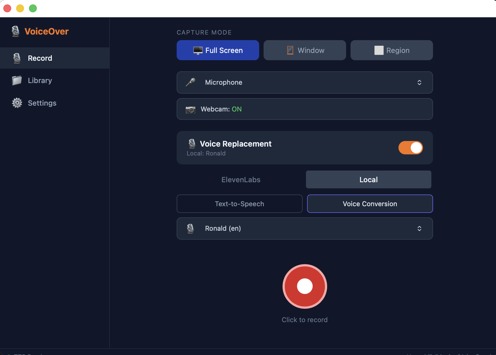
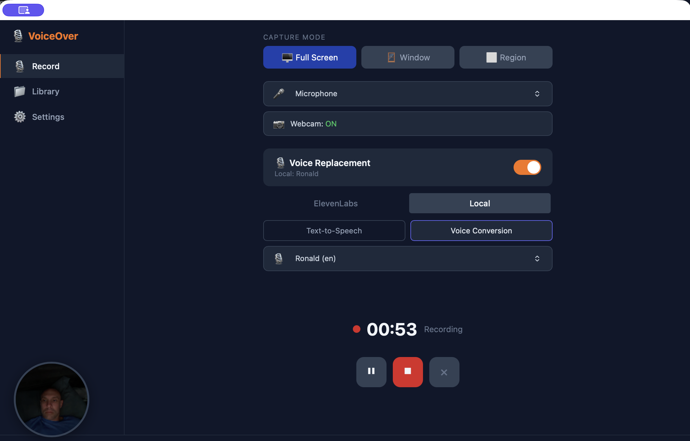
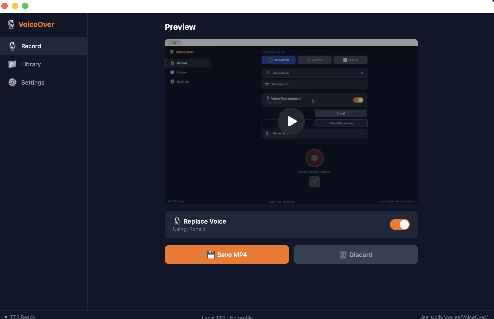
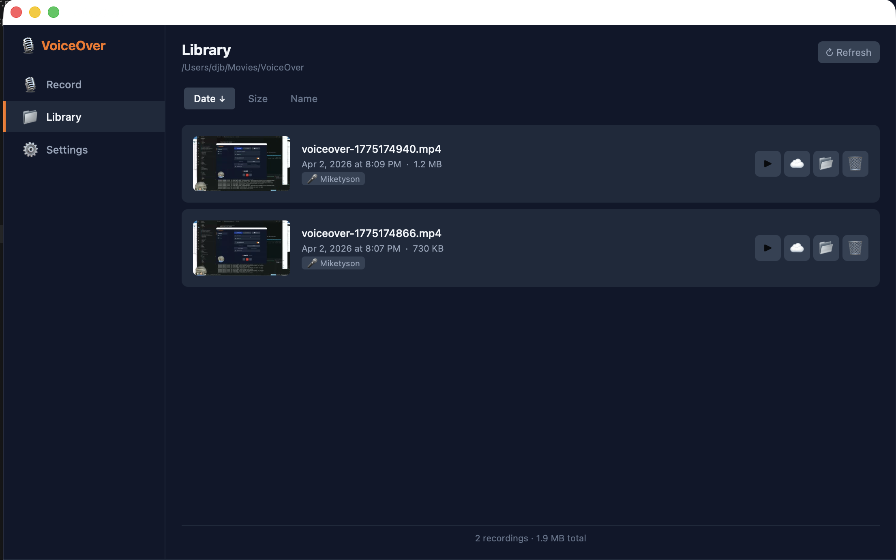
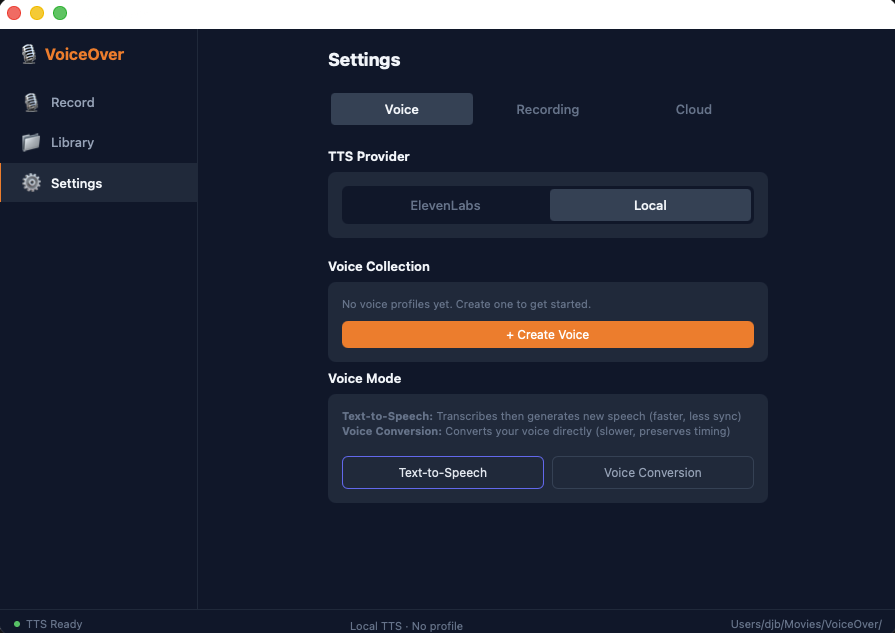
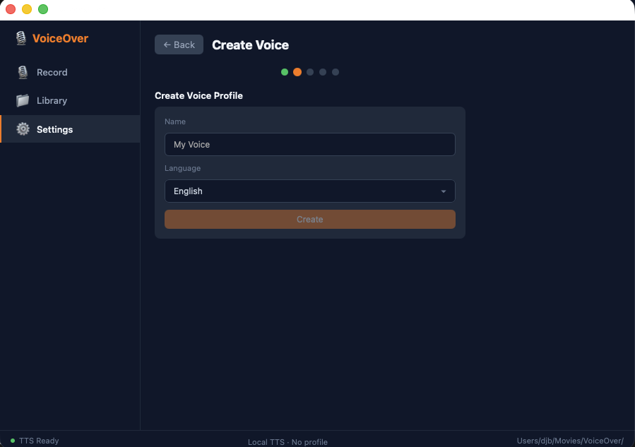
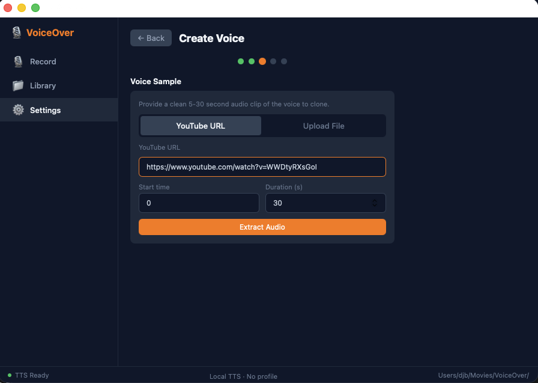
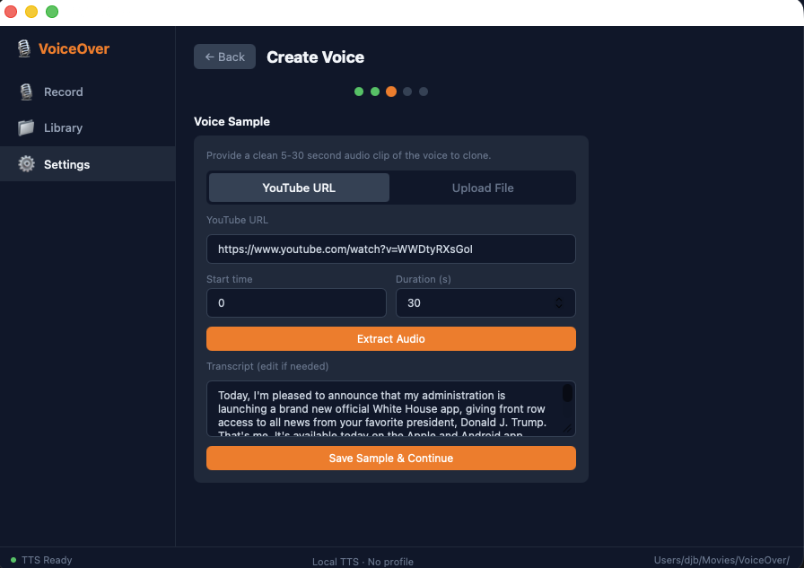
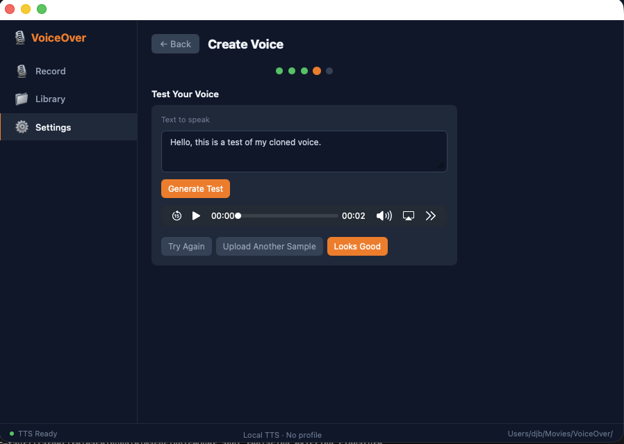
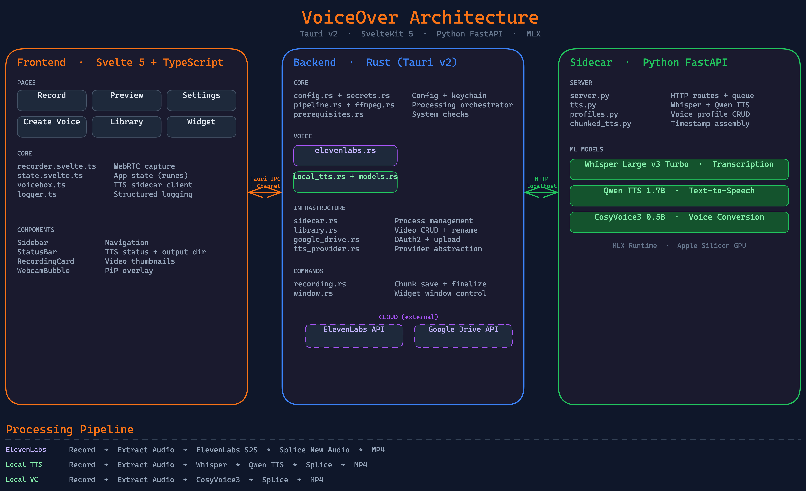

# VoiceOver

A desktop screen recorder that replaces your voice with a cloned character voice — record, transform, and export in a single workflow. Supports **ElevenLabs** (cloud) and a **built-in local TTS engine** powered by Qwen TTS and CosyVoice3 on Apple Silicon.

Built with Tauri v2 (Rust backend), SvelteKit 5 (TypeScript frontend), and a Python FastAPI sidecar for on-device ML inference.



## What It Does

VoiceOver eliminates the multi-step process of recording a screen capture, uploading audio to a voice service, and manually splicing the result. Instead:

1. **Record** your screen (full screen, window, or region) with microphone audio
2. **Transform** your voice using ElevenLabs (cloud) or the built-in local engine
3. **Preview** the result and save as MP4
4. **Upload** (optional) to Google Drive for a shareable link

The entire pipeline happens in one app — no external tools, no file juggling.

### Local Voice Engine

The bundled TTS sidecar runs entirely on your machine. No API keys, no cloud — your audio never leaves your computer. Two modes:

| Mode | Engine | How It Works | Best For |
|------|--------|-------------|----------|
| **Text-to-Speech** | Qwen TTS | Transcribes your speech (Whisper), then regenerates it with your cloned voice at the original word timestamps | Clean re-generation; fixes stumbles while keeping pacing |
| **Voice Conversion** | CosyVoice3 | Directly converts your voice to the target voice in a single pass | Preserving your exact timing, prosody, and emphasis |

Both modes use voice profiles you create from audio samples — upload a clip of someone's voice (or extract one from YouTube), and VoiceOver clones it for all future recordings.

## Screenshots

| Record | Recording |
|--------|-----------|
|  |  |

| Preview | Library |
|---------|---------|
|  |  |

### Voice Creation Wizard

| Settings | Create Profile | Voice Sample |
|----------|---------------|-------------|
|  |  |  |

| Transcription | Test Voice |
|--------------|------------|
|  |  |

## Features

- **Screen capture** — full screen, window, or region selection via native OS picker
- **Optional webcam overlay** — picture-in-picture bubble composited into the video output, toggleable position
- **Microphone selection** — pick any connected audio input device
- **ElevenLabs Speech-to-Speech** — cloud voice transformation that preserves timing and emotion
- **Built-in local TTS engine** — runs entirely on your machine, no API keys or external servers needed
  - **Text-to-Speech mode** — Whisper transcription → Qwen TTS regeneration with timestamp-synced pacing
  - **Voice Conversion mode** — CosyVoice3 speech-to-speech cloning that preserves your exact prosody
- **Voice creation wizard** — create voice profiles from audio samples or YouTube URLs with auto-transcription
- **Video library** — browse past recordings with thumbnails, sort by date/size/name, rename, play, delete, or upload
- **Voice collection** — save multiple voices (ElevenLabs IDs or local profiles) with friendly names
- **Voice replacement toggle** — on by default, turn off to save raw recordings
- **Background noise removal** — ElevenLabs strips noise before transformation
- **Google Drive upload** — OAuth2 flow, uploads and returns a shareable link
- **Floating recording widget** — Loom-style always-on-top pill with timer and controls
- **Transcript export** — `.txt` file alongside output video with word-level timing from Whisper

## Architecture



The **Python sidecar** is a FastAPI server that runs as a managed subprocess, started automatically on app launch. It handles:
- **Transcription** — Whisper Large v3 Turbo (MLX) for speech-to-text
- **TTS generation** — Qwen TTS with voice cloning from audio samples
- **Voice conversion** — CosyVoice3 speech-to-speech that preserves original timing and prosody

The frontend never calls the sidecar directly — all requests route through the Rust backend via `sidecar_fetch` / `sidecar_upload` commands.

**Processing pipeline:**

```
ElevenLabs:  Record → Extract Audio → ElevenLabs S2S → Splice New Audio → Final Video
Local TTS:   Record → Extract Audio → Transcribe (Whisper) → Qwen TTS Generate → Splice → Final Video
Local VC:    Record → Extract Audio → CosyVoice3 Voice Conversion → Splice → Final Video
```

- Desktop mode: ffmpeg CLI handles extraction and splicing
- Browser mode: ffmpeg.wasm handles splicing in-browser

## System Requirements

### Apple Silicon (Local TTS)

The local TTS engine uses [MLX](https://github.com/ml-explore/mlx) for on-device inference and requires **Apple Silicon**. Tested on an **M5 Max Pro** — the minimum M-series chip hasn't been verified, but any M1 or later should work (inference speed will vary with unified memory and GPU cores).

The following models need to be downloaded before using local TTS:

| Model | Purpose | Download |
|-------|---------|----------|
| **Whisper Large v3 Turbo** | Speech-to-text transcription | Create Voice wizard |
| **Qwen TTS 1.7B** | Text-to-speech generation | Create Voice wizard |
| **CosyVoice3 0.5B** | Voice conversion | Create Voice wizard |

All three models are downloaded from the **Create Voice** wizard (Settings → + Create Voice). This is a one-time download (~5GB total). Models are stored in `~/Library/Application Support/com.voiceover.app/models/`.

> **Note:** If you only use ElevenLabs (cloud), Apple Silicon and model downloads are not required.

## Prerequisites

### macOS

```bash
# Xcode command line tools (required for Tauri/WebKit)
xcode-select --install

# ffmpeg (runtime dependency for audio/video processing)
brew install ffmpeg
```

### Linux (Ubuntu/Debian)

```bash
# Tauri v2 build dependencies (GTK/WebKit)
sudo apt-get install -y \
  libgtk-3-dev \
  libgdk-pixbuf2.0-dev \
  libatk1.0-dev \
  libsoup-3.0-dev \
  libjavascriptcoregtk-4.1-dev \
  libwebkit2gtk-4.1-dev

# ffmpeg (runtime dependency)
sudo apt-get install -y ffmpeg
```

### Build Tools (Both Platforms)

**Rust:**
```bash
curl --proto '=https' --tlsv1.2 -sSf https://sh.rustup.rs | sh
source $HOME/.cargo/env
```

**Node.js** (v20+):
```bash
# via nvm (recommended)
curl -o- https://raw.githubusercontent.com/nvm-sh/nvm/v0.40.0/install.sh | bash
nvm install 20
```

**pnpm:**
```bash
npm install -g pnpm
```

## Installation

```bash
git clone <repo-url>
cd voiceover
pnpm install
```

## Development

```bash
# Start the desktop app in dev mode (hot-reloads both Svelte and Rust)
pnpm tauri dev

# Or run just the frontend (browser mode at http://localhost:5170)
pnpm dev
```

The desktop app opens a native window. You can also open `http://localhost:5170` in Chrome for browser-mode development with full pipeline support.

### Browser Mode

When running via `pnpm tauri dev`, you can use the app in Chrome at `http://localhost:5170`. This mode:

- Records using browser WebRTC APIs (works reliably in Chrome)
- Calls ElevenLabs S2S directly via `fetch`
- Splices video + audio using ffmpeg.wasm (loaded from `static/ffmpeg/`)
- Stores settings in `localStorage`

**Config precedence:**
1. **Tauri app config** — stored in the OS app data directory (primary, used at runtime)
2. **`static/_config.json`** — development/build-time fallback only, stripped from production builds

## Testing

```bash
# Run all tests (frontend + backend)
pnpm test:all

# Frontend only (Vitest)
pnpm test

# Backend only (Rust)
pnpm test:rust

# Watch mode (frontend, re-runs on file changes)
pnpm test:watch

# Coverage reports with HTML graphs
pnpm test:coverage          # Frontend → coverage/index.html
pnpm test:rust:coverage     # Backend  → src-tauri/target/llvm-cov/html/index.html
pnpm test:all:coverage      # Both
```

Pre-commit hooks (via [lefthook](https://github.com/evilmartians/lefthook)) run frontend tests, Rust tests, and type checking in parallel before every commit.

## Building for Distribution

```bash
# Build optimized release bundles
pnpm tauri build
```

This produces:
- **macOS:** `.dmg` installer in `src-tauri/target/release/bundle/dmg/`
- **Linux:** `.AppImage` and `.deb` in `src-tauri/target/release/bundle/`

The macOS build is code-signed with a Developer ID and hardened runtime.

## Configuration

All settings are managed in-app via the Settings screen. No config files to edit manually.

### ElevenLabs Setup

1. Get an API key from [elevenlabs.io](https://elevenlabs.io)
2. Open Settings in the app
3. Enter your API key and click **Test** to verify
4. Add voices: enter a **name** and **voice ID** (find IDs in your ElevenLabs voice library)
5. Set a default voice

> **Tip:** Set `export ELEVENLABS_API_KEY=sk_...` in your shell profile (`.zshrc` / `.bashrc`) and the app will auto-detect it — no need to enter the key manually in Settings.

### Local TTS Setup (Optional)

The local TTS engine is built into VoiceOver — no external servers to install. It runs as a managed sidecar process that starts automatically with the app.

**1. Download models:**

On first launch, open **Settings → Local** and download the required models (Whisper, Qwen TTS, and/or CosyVoice3 depending on your preferred mode). This is a one-time download.

**2. Create a voice profile:**

1. On the **Record** screen, click **+ Create Voice** (or go to Settings)
2. Name your voice and upload audio samples — you can record directly, upload files, or paste a YouTube URL to extract a voice
3. Each sample is auto-transcribed for reference text
4. The more varied samples you provide (5–30 seconds each), the better the clone

**3. Select provider and mode:**

1. On the **Record** screen, toggle the provider to **Local**
2. Choose your mode:
   - **Text-to-Speech** — transcribes then regenerates (cleaner output, fixes stumbles)
   - **Voice Conversion** — direct voice swap (preserves exact timing and emotion)
3. Select your voice profile from the dropdown
4. Record as normal

**Supported audio formats for samples:** `.wav`, `.mp3`, `.m4a`, `.ogg`, `.flac`, `.aac`, `.webm`, `.opus` (max 50MB per sample)

### Google Drive Setup (Optional)

1. Create a project in [Google Cloud Console](https://console.cloud.google.com)
2. Enable the Google Drive API
3. Create OAuth 2.0 credentials (Desktop application type)
4. In the app Settings, enter the **Client ID** and **Client Secret**
5. Click **Connect Google Drive** and authorize

After connecting, the app provides a shareable Google Drive link when you save a recording.

### Settings Storage

- **Desktop app:** `~/.local/share/com.voiceover.app/config.json` (Linux) or `~/Library/Application Support/com.voiceover.app/config.json` (macOS)
- **Browser mode:** `localStorage` (with `static/_config.json` as dev-only fallback, stripped from production builds)

## Project Structure

```
voiceover/
├── src/                          # Svelte frontend
│   ├── app.css                   # Global styles (dark theme)
│   ├── lib/
│   │   ├── recorder.svelte.ts    # WebRTC capture + MediaRecorder
│   │   ├── state.svelte.ts       # App state (Svelte 5 runes)
│   │   ├── voicebox.ts           # Local TTS client (routes through Tauri IPC)
│   │   ├── logger.ts             # Structured logging ([VO:*] prefix)
│   │   ├── library.svelte.ts     # Video library state & sorting
│   │   ├── drive.ts              # Google Drive upload utilities
│   │   ├── tauri.ts              # IPC wrapper (tauriInvoke)
│   │   ├── Sidebar.svelte        # Navigation sidebar
│   │   ├── StatusBar.svelte      # Bottom status bar (TTS status, profile, output dir)
│   │   ├── RecordingCard.svelte  # Video thumbnail card (library)
│   │   ├── WebcamBubble.svelte   # Webcam bubble overlay (live preview)
│   │   └── RegionSelector.svelte # Screen region selection overlay
│   └── routes/(app)/
│       ├── +layout.svelte        # Root layout, config loading
│       ├── +page.svelte          # Home screen (record controls)
│       ├── preview/+page.svelte  # Preview, process, save/upload
│       ├── settings/+page.svelte # API key, voices, Drive, output
│       ├── create-voice/+page.svelte # Voice creation wizard
│       ├── library/+page.svelte  # Video library browser
│       └── widget/+page.svelte   # Floating recording widget
├── src-tauri/                    # Rust backend
│   ├── Cargo.toml
│   ├── tauri.conf.json
│   ├── entitlements.plist        # macOS security entitlements
│   ├── capabilities/
│   │   └── default.json          # Tauri permissions
│   └── src/
│       ├── main.rs               # Entry point
│       ├── lib.rs                # Tauri builder, plugin registration
│       ├── config.rs             # JSON config read/write + env var fallback
│       ├── prerequisites.rs      # ffmpeg detection
│       ├── ffmpeg.rs             # Audio extraction, video muxing, duration probing
│       ├── elevenlabs.rs         # S2S API client (reqwest)
│       ├── local_tts.rs          # Local TTS client (transcribe → generate → voice convert)
│       ├── models.rs             # Model download + status (HuggingFace)
│       ├── pipeline.rs           # Processing orchestrator
│       ├── sidecar.rs            # Sidecar process management (start/stop/health)
│       ├── library.rs            # Video library (list, rename, delete, thumbnails)
│       ├── google_drive.rs       # OAuth2 + upload
│       ├── secrets.rs            # OS keychain storage for API keys
│       ├── tts_provider.rs       # Provider enum (ElevenLabs / Local)
│       └── commands/
│           ├── recording.rs      # Chunk saving, finalization
│           └── window.rs         # Widget window management
├── src-tauri/sidecar/            # Python TTS sidecar (FastAPI)
│   ├── server.py                 # Main FastAPI server
│   ├── tts.py                    # Qwen TTS synthesis + Whisper transcription
│   ├── profiles.py               # Voice profile management
│   ├── chunked_tts.py            # Chunked generation + timestamp-aware assembly
│   ├── requirements.txt          # Python dependencies (mlx, qwen-tts, torch)
│   ├── entitlements.plist        # Sidecar code signing entitlements
│   └── voiceover-tts.spec        # PyInstaller build spec
├── static/
│   └── ffmpeg/                   # ffmpeg.wasm core (browser mode)
├── scripts/
│   └── build-sidecar.sh          # Build + sign + test sidecar binary
├── package.json
├── svelte.config.js
└── vite.config.ts
```

## Tech Stack

| Layer | Technology |
|-------|-----------|
| Desktop framework | Tauri v2 |
| Frontend | Svelte 5 + SvelteKit |
| Frontend language | TypeScript |
| Backend language | Rust |
| Video processing | ffmpeg (CLI) / ffmpeg.wasm (browser) |
| Voice API (cloud) | ElevenLabs Speech-to-Speech v1 |
| Voice API (local) | Python sidecar: Qwen TTS (text-to-speech) + CosyVoice3 (voice conversion) |
| Transcription | MLX Whisper Large v3 Turbo |
| HTTP client | reqwest (Rust) / fetch (browser) |
| Cloud upload | Google Drive API v3 |
| State management | Svelte 5 runes |

## Command & API Reference

### Tauri Commands

These are the IPC commands exposed by the Rust backend, invoked from the frontend via `tauriInvoke()`.

| Command | Description |
|---|---|
| `check_prerequisites` | Verify system dependencies (ffmpeg) |
| `get_config` | Read app configuration |
| `save_config` | Write app configuration |
| `save_recording_chunk` | Save a recording chunk to disk |
| `finalize_recording` | Finalize recording and produce output file |
| `get_temp_dir` | Get the app's temp directory path |
| `read_file_bytes` | Read a file as raw bytes |
| `create_widget_window` | Open the floating recording widget |
| `close_widget_window` | Close the floating recording widget |
| `process_recording` | Run the full processing pipeline (extract, transform, splice) |
| `test_api_key` | Validate an ElevenLabs API key |
| `test_local_connection` | Check sidecar connectivity |
| `list_local_voices` | List voice profiles from the sidecar |
| `check_model_status` | Check if TTS models are downloaded/loaded |
| `extract_youtube_audio` | Extract audio from a YouTube URL via the sidecar |
| `sidecar_fetch` | Proxy a GET/POST request to the sidecar |
| `sidecar_upload` | Proxy a file upload to the sidecar |
| `get_sidecar_status` | Get sidecar process status |
| `check_models_downloaded` | Check if required models are available |
| `download_model` | Download a model from HuggingFace |
| `get_models_disk_usage` | Get disk usage of downloaded models |
| `google_drive_connect` | Start Google Drive OAuth2 flow |
| `google_drive_disconnect` | Disconnect Google Drive |
| `poll_generation` | Poll TTS generation status |
| `get_generation_audio` | Download generated audio as bytes |
| `upload_to_drive` | Upload a file to Google Drive |
| `list_recordings` | List saved recordings with metadata |
| `generate_thumbnail` | Extract a thumbnail JPEG from a video |
| `delete_recording` | Delete a recording and its companions |
| `rename_recording` | Rename a recording file |
| `open_in_system` | Open a file with the default system app |
| `reveal_in_finder` | Reveal a file in Finder |

### Sidecar Routes

HTTP endpoints served by the Python FastAPI sidecar on localhost.

| Route | Method | Description |
|---|---|---|
| `/health` | GET | Health check + model availability |
| `/transcribe` | POST | Transcribe uploaded audio (Whisper) |
| `/transcribe-path` | POST | Transcribe audio from a file path on disk |
| `/generate` | POST | Start TTS generation (returns generation ID) |
| `/generate/{gen_id}/status` | GET | Poll generation status |
| `/audio/{gen_id}` | GET | Download generated audio |
| `/voice-convert` | POST | Voice conversion via CosyVoice3 (speech-to-speech) |
| `/extract-youtube` | POST | Download YouTube audio, extract and clip to WAV |
| `/profiles` | GET | List all voice profiles |
| `/profiles` | POST | Create a new voice profile |
| `/profiles/{id}/samples` | POST | Upload a voice sample to a profile |
| `/profiles/{id}/samples/from-path` | POST | Add a voice sample from a file path on disk |
| `/profiles/{id}` | DELETE | Delete a voice profile |
| `/models/status` | GET | Get model download/load status |
| `/models/download` | POST | Download a model (streams progress as SSE) |

## Debugging

### Browser Console

Open DevTools (F12) and filter by `[VO:` to see app logs:

```
[VO:config]     Loaded from static/_config.json
[VO:record]     Starting capture: fullscreen
[VO:record]     Screen stream: monitor 1
[VO:record]     Audio stream: Default Mic
[VO:record]     Chunk 0: 245.3KB
[VO:elevenlabs] Speech-to-Speech: voice=Cb8NLd0s
[VO:elevenlabs] S2S complete in 3.2s
[VO:pipeline]   Splicing video + audio (75%)
[VO:pipeline]   Complete: voiceover-1234567890.webm (2.1MB)
```

### Rust Terminal

When running `pnpm tauri dev`, Rust logs appear in the terminal:

```
[elevenlabs] S2S request: voice=Cb8NLd0s, input_size=156KB
[elevenlabs] S2S response: status=200, elapsed=3.2s
[pipeline] Complete: /home/user/Videos/VoiceOver/voiceover-123.mp4 (total 4.1s)
```

## Known Issues

- **Local TTS sidecar startup lag** — the bundled TTS engine takes 10–30 seconds to load on first launch (loading ML models into memory). During this time, local voice profiles won't appear in the dropdown. The status bar at the bottom of the app shows "TTS Ready" once the sidecar is loaded.
- **Apple Silicon only for local TTS** — the local engine uses MLX for inference and requires Apple Silicon. Tested on M5 Max Pro; minimum M-series chip is unknown. ElevenLabs (cloud) works on any hardware.
- **Voice quality depends on your samples** — provide 3–5 varied samples of 5–30 seconds each for best results. Poor quality or noisy reference audio will produce poor clones.
- **ElevenLabs S2S limit** — maximum 5 minutes of audio per API call.
- **Webcam bubble** — limited to bottom-left/bottom-right positions, captured at 640x480 @ 30fps.
- **Google Drive OAuth** — connection must be established from the desktop app (uses loopback redirect).
- **TTS audio cutoff** — local TTS output may cut off the last 1–2 seconds of audio abruptly. Under investigation.

## License

MIT
