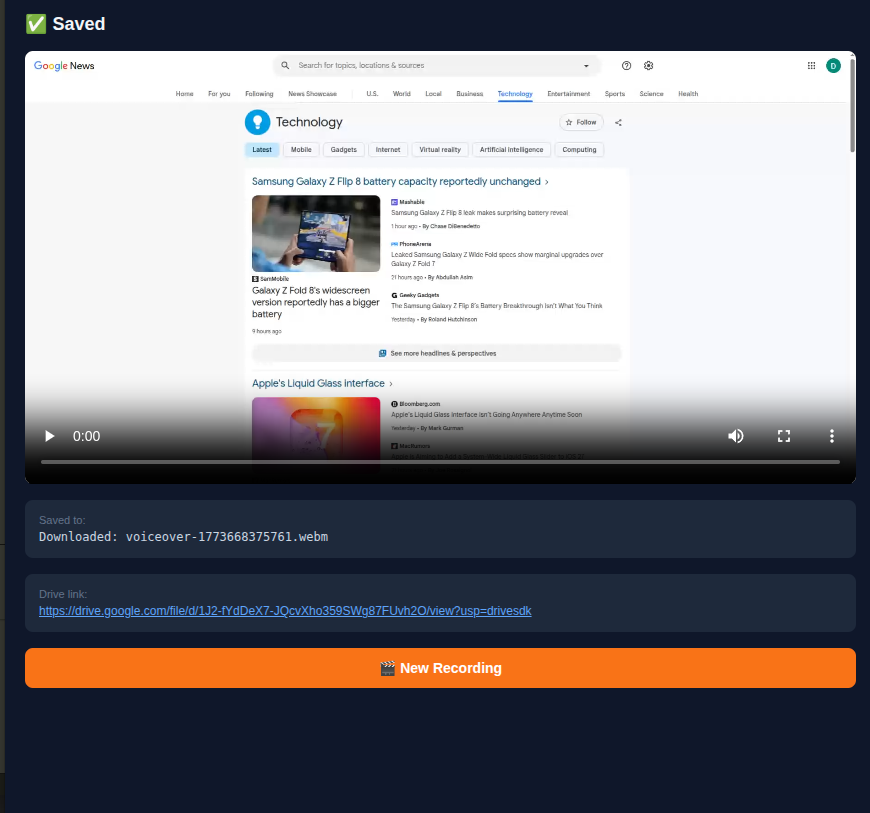
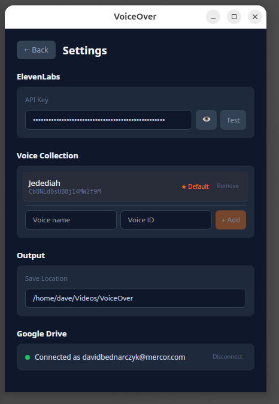

# VoiceOver

A lightweight desktop screen recorder that replaces your voice with a character voice — record, transform, and export in a single workflow. Supports **ElevenLabs** (cloud) and **Voicebox** (local, runs on your machine).

Built with Tauri v2 (Rust backend) and SvelteKit 5 (TypeScript frontend). Runs on macOS and Linux.


## What It Does

VoiceOver eliminates the multi-step process of recording a screen capture, uploading audio to a voice service, and manually splicing the result. Instead:

1. **Record** your screen (full screen, window, or region) with microphone audio
2. **Transform** your voice using ElevenLabs (cloud) or Voicebox (local)
3. **Export** a final video with the transformed voice perfectly synced
4. **Upload** (optional) to Google Drive for a shareable link

The entire pipeline happens in one app. Your pacing, pauses, and emphasis are preserved — both providers transform the voice while keeping your natural cadence.

## Screenshots

| Record | Preview | Save to Drive |
|--------|---------|---------------|
|  |  |  |

| Settings |
|----------|
|  |

## Features

- **Screen capture** — full screen, window, or region selection via native OS picker
- **Optional webcam overlay** — picture-in-picture bubble during recording. Toggle webcam via the camera button on the home screen. Click the arrow on the bubble to move it between bottom-left and bottom-right. The bubble is composited into the recorded video output (not just a preview overlay)
- **Microphone selection** — pick any connected audio input device
- **ElevenLabs Speech-to-Speech** — cloud voice transformation that preserves timing and emotion
- **Voicebox local TTS** — runs entirely on your machine via [Voicebox](https://github.com/jamiepine/voicebox), no API keys needed. Uses Qwen TTS with voice cloning from audio samples
- **Voice collection** — save multiple voice IDs (ElevenLabs) or voice profiles (Voicebox) with friendly names
- **Voice replacement toggle** — on by default, turn off to save raw recordings
- **Background noise removal** — ElevenLabs strips noise before transformation
- **Google Drive upload** — OAuth2 flow, uploads and returns a shareable link
- **Floating recording widget** — Loom-style always-on-top pill with timer and controls
- **Browser mode** — full pipeline works in Chrome at localhost (ffmpeg.wasm for splicing)
- **Structured logging** — `[VO:*]` prefixed logs in browser console and Rust terminal

## Architecture

```
SvelteKit Frontend (TypeScript)
    ↓ Tauri IPC (invoke)
Rust Backend (Tauri v2)
    ↓ HTTP (localhost)
Python Sidecar (FastAPI + Qwen TTS / CosyVoice3)
```

```
Frontend (Svelte 5 + TypeScript)          Backend (Rust)                Python Sidecar (FastAPI)
┌──────────────────────────┐    Tauri     ┌──────────────────────────┐    HTTP     ┌──────────────────────┐
│ Home Screen              │   Commands   │ prerequisites.rs         │  localhost  │ server.py            │
│ Recording Widget         │ ◄──────────► │ config.rs                │ ◄─────────► │ tts.py               │
│ Preview & Process        │   + Channel  │ ffmpeg.rs                │             │ profiles.py          │
│ Settings                 │    Events    │ elevenlabs.rs            │             │ chunked_tts.py       │
│                          │              │ pipeline.rs              │             │                      │
│ recorder.svelte.ts       │              │ local_tts.rs             │             │ Whisper (transcribe)  │
│ state.svelte.ts          │              │ sidecar.rs               │             │ Qwen TTS (generate)   │
│ logger.ts                │              │ google_drive.rs          │             │ CosyVoice3 (convert)  │
│ WebcamBubble.svelte      │              │ commands/recording.rs    │             │                      │
└──────────────────────────┘              └──────────────────────────┘             └──────────────────────┘
```

The **Python sidecar** is a FastAPI server that runs as a managed subprocess, started automatically on app launch. It handles:
- **Transcription** — Whisper Large v3 Turbo (MLX) for speech-to-text
- **TTS generation** — Qwen TTS with voice cloning from audio samples
- **Voice conversion** — CosyVoice3 speech-to-speech that preserves original timing and prosody

The frontend never calls the sidecar directly — all requests route through the Rust backend via `sidecar_fetch` / `sidecar_upload` commands.

**Processing pipeline:**

```
ElevenLabs:  Record → Extract Audio → ElevenLabs S2S → Splice New Audio → Final Video
Local TTS:   Record → Extract Audio → Transcribe (Whisper) → Qwen TTS Generate → Splice → Final Video
Local VC:    Record → Extract Audio → CosyVoice3 Voice Conversion → Splice → Final Video
```

- Desktop mode: ffmpeg CLI handles extraction and splicing
- Browser mode: ffmpeg.wasm handles splicing in-browser

## Prerequisites

### macOS

```bash
# Xcode command line tools (required for Tauri/WebKit)
xcode-select --install

# ffmpeg (runtime dependency for audio/video processing)
brew install ffmpeg
```

### Linux (Ubuntu/Debian)

```bash
# Tauri v2 build dependencies (GTK/WebKit)
sudo apt-get install -y \
  libgtk-3-dev \
  libgdk-pixbuf2.0-dev \
  libatk1.0-dev \
  libsoup-3.0-dev \
  libjavascriptcoregtk-4.1-dev \
  libwebkit2gtk-4.1-dev

# ffmpeg (runtime dependency)
sudo apt-get install -y ffmpeg
```

### Build Tools (Both Platforms)

**Rust:**
```bash
curl --proto '=https' --tlsv1.2 -sSf https://sh.rustup.rs | sh
source $HOME/.cargo/env
```

**Node.js** (v20+):
```bash
# via nvm (recommended)
curl -o- https://raw.githubusercontent.com/nvm-sh/nvm/v0.40.0/install.sh | bash
nvm install 20
```

**pnpm:**
```bash
npm install -g pnpm
```

## Installation

```bash
git clone <repo-url>
cd voiceover
pnpm install
```

## Development

```bash
# Start the desktop app in dev mode (hot-reloads both Svelte and Rust)
pnpm tauri dev

# Or run just the frontend (browser mode at http://localhost:5170)
pnpm dev
```

The desktop app opens a native window. You can also open `http://localhost:5170` in Chrome for browser-mode development with full pipeline support.

### Browser Mode

When running via `pnpm tauri dev`, you can use the app in Chrome at `http://localhost:5170`. This mode:

- Records using browser WebRTC APIs (works reliably in Chrome)
- Calls ElevenLabs S2S directly via `fetch`
- Splices video + audio using ffmpeg.wasm (loaded from `static/ffmpeg/`)
- Stores settings in `localStorage`

**Config precedence:**
1. **Tauri app config** — stored in the OS app data directory (primary, used at runtime)
2. **`static/_config.json`** — development/build-time fallback only, stripped from production builds

## Testing

```bash
# Run all tests (frontend + backend)
pnpm test:all

# Frontend only (Vitest)
pnpm test

# Backend only (Rust)
pnpm test:rust

# Watch mode (frontend, re-runs on file changes)
pnpm test:watch

# Coverage reports with HTML graphs
pnpm test:coverage          # Frontend → coverage/index.html
pnpm test:rust:coverage     # Backend  → src-tauri/target/llvm-cov/html/index.html
pnpm test:all:coverage      # Both
```

Pre-commit hooks (via [lefthook](https://github.com/evilmartians/lefthook)) run frontend tests, Rust tests, and type checking in parallel before every commit.

## Building for Distribution

```bash
# Build optimized release bundles
pnpm tauri build
```

This produces:
- **macOS:** `.dmg` installer in `src-tauri/target/release/bundle/dmg/`
- **Linux:** `.AppImage` and `.deb` in `src-tauri/target/release/bundle/`

### Installing the .app (macOS)

The app is unsigned. After dragging VoiceOver.app to Applications, open Terminal and run:

```bash
xattr -cr /Applications/VoiceOver.app
```

This removes the macOS quarantine flag. You only need to do this once.

## Configuration

All settings are managed in-app via the Settings screen. No config files to edit manually.

### ElevenLabs Setup

1. Get an API key from [elevenlabs.io](https://elevenlabs.io)
2. Open Settings in the app
3. Enter your API key and click **Test** to verify
4. Add voices: enter a **name** and **voice ID** (find IDs in your ElevenLabs voice library)
5. Set a default voice


### Voicebox Setup (Local Voice — Optional)

Voicebox is a local TTS server that runs on your machine. No API keys, no cloud — your audio never leaves your computer.

**1. Install and run Voicebox:**

```bash
git clone https://github.com/jamiepine/voicebox
cd voicebox
# Follow Voicebox README for setup (Docker or native)
```

Voicebox runs at `http://localhost:17493` by default.

**2. Create a voice profile:**

You can create a voice profile directly from VoiceOver:

1. Open **Settings** in VoiceOver
2. Under **Local Voice Server**, verify the connection shows green
3. Click **+ Create Voice**
4. Follow the wizard: name your voice, upload audio samples (MP3, WAV, etc.), and add reference text for each sample
5. Test the voice with a preview generation

Or create profiles in the Voicebox web UI at `http://localhost:17493`.

**3. Select the provider and mode:**

1. In **Settings**, switch the provider toggle to **Local**
2. Select your voice profile from the dropdown
3. Choose a **local TTS mode** (controlled by the `local_tts_mode` setting):

| Mode | How it works | Best for |
|------|-------------|----------|
| **Text-to-Speech (TTS)** | Transcribes your audio to text (Whisper), then regenerates speech with Qwen TTS using your voice profile | Clean re-generation with a cloned voice; output follows the *words* of your recording |
| **Voice Conversion (VC)** | Uses CosyVoice3 to convert your voice directly to the target voice | Preserving your exact timing, pacing, and prosody; speech-to-speech with natural cadence |

4. Record as normal — VoiceOver processes the audio through the selected pipeline and splices the result into the final video

**Supported audio formats for samples:** `.wav`, `.mp3`, `.m4a`, `.ogg`, `.flac`, `.aac`, `.webm`, `.opus` (max 50MB per sample)

### Google Drive Setup (Optional)

1. Create a project in [Google Cloud Console](https://console.cloud.google.com)
2. Enable the Google Drive API
3. Create OAuth 2.0 credentials (Desktop application type)
4. In the app Settings, enter the **Client ID** and **Client Secret**
5. Click **Connect Google Drive** and authorize

After saving, the app provides a shareable Google Drive link:


### Settings Storage

- **Desktop app:** `~/.local/share/com.voiceover.app/config.json` (Linux) or `~/Library/Application Support/com.voiceover.app/config.json` (macOS)
- **Browser mode:** `localStorage` (with `static/_config.json` as dev-only fallback, stripped from production builds)

## Project Structure

```
voiceover/
├── src/                          # Svelte frontend
│   ├── app.css                   # Global styles (dark theme)
│   ├── lib/
│   │   ├── logger.ts             # Structured logging ([VO:*] prefix)
│   │   ├── recorder.svelte.ts    # WebRTC capture + MediaRecorder
│   │   ├── state.svelte.ts       # App state (Svelte 5 runes)
│   │   ├── voicebox.ts           # Voicebox API client (routes through Tauri IPC)
│   │   └── WebcamBubble.svelte   # Webcam bubble overlay (live preview)
│   └── routes/
│       ├── +layout.svelte        # Root layout, config loading
│       ├── +page.svelte          # Home screen (record controls)
│       ├── preview/+page.svelte  # Preview, process, save/upload
│       ├── settings/+page.svelte # API key, voices, Drive, output
│       ├── create-voice/+page.svelte # Voicebox voice creation wizard
│       └── widget/+page.svelte   # Floating recording widget
├── src-tauri/                    # Rust backend
│   ├── Cargo.toml
│   ├── tauri.conf.json
│   ├── capabilities/
│   │   └── default.json          # Tauri permissions
│   └── src/
│       ├── main.rs               # Entry point
│       ├── lib.rs                # Tauri builder, plugin registration
│       ├── config.rs             # JSON config read/write
│       ├── prerequisites.rs      # ffmpeg detection
│       ├── ffmpeg.rs             # Audio extraction + video muxing
│       ├── elevenlabs.rs         # S2S API client (reqwest)
│       ├── local_tts.rs          # Voicebox client (transcribe → generate)
│       ├── pipeline.rs           # Processing orchestrator
│       ├── google_drive.rs       # OAuth2 + upload
│       └── commands/
│           ├── recording.rs      # Chunk saving, finalization
│           └── window.rs         # Widget window management
├── src-tauri/sidecar/            # Python TTS sidecar (FastAPI)
│   ├── server.py                 # Main FastAPI server
│   ├── tts.py                    # Qwen TTS synthesis + Whisper transcription
│   ├── profiles.py               # Voice profile management
│   ├── chunked_tts.py            # Chunked generation for long text
│   └── requirements.txt          # Python dependencies (mlx, qwen-tts, torch)
├── static/
│   └── ffmpeg/                   # ffmpeg.wasm core (browser mode)
├── package.json
├── svelte.config.js
└── vite.config.ts
```

## Tech Stack

| Layer | Technology |
|-------|-----------|
| Desktop framework | Tauri v2 |
| Frontend | Svelte 5 + SvelteKit |
| Frontend language | TypeScript |
| Backend language | Rust |
| Video processing | ffmpeg (CLI) / ffmpeg.wasm (browser) |
| Voice API (cloud) | ElevenLabs Speech-to-Speech v1 |
| Voice API (local) | Python sidecar: Qwen TTS (text-to-speech) + CosyVoice3 (voice conversion) |
| Transcription | MLX Whisper Large v3 Turbo |
| HTTP client | reqwest (Rust) / fetch (browser) |
| Cloud upload | Google Drive API v3 |
| State management | Svelte 5 runes |

## Command & API Reference

### Tauri Commands

These are the IPC commands exposed by the Rust backend, invoked from the frontend via `tauriInvoke()`.

| Command | Description |
|---|---|
| `check_prerequisites` | Verify system dependencies (ffmpeg) |
| `get_config` | Read app configuration |
| `save_config` | Write app configuration |
| `save_recording_chunk` | Save a recording chunk to disk |
| `finalize_recording` | Finalize recording and produce output file |
| `get_temp_dir` | Get the app's temp directory path |
| `read_file_bytes` | Read a file as raw bytes |
| `create_widget_window` | Open the floating recording widget |
| `close_widget_window` | Close the floating recording widget |
| `process_recording` | Run the full processing pipeline (extract, transform, splice) |
| `test_api_key` | Validate an ElevenLabs API key |
| `test_local_connection` | Check sidecar connectivity |
| `list_local_voices` | List voice profiles from the sidecar |
| `check_model_status` | Check if TTS models are downloaded/loaded |
| `extract_youtube_audio` | Extract audio from a YouTube URL via the sidecar |
| `sidecar_fetch` | Proxy a GET/POST request to the sidecar |
| `sidecar_upload` | Proxy a file upload to the sidecar |
| `get_sidecar_status` | Get sidecar process status |
| `check_models_downloaded` | Check if required models are available |
| `download_model` | Download a model from HuggingFace |
| `get_models_disk_usage` | Get disk usage of downloaded models |
| `google_drive_connect` | Start Google Drive OAuth2 flow |
| `google_drive_disconnect` | Disconnect Google Drive |
| `upload_to_drive` | Upload a file to Google Drive |

### Sidecar Routes

HTTP endpoints served by the Python FastAPI sidecar on localhost.

| Route | Method | Description |
|---|---|---|
| `/health` | GET | Health check + model availability |
| `/transcribe` | POST | Transcribe uploaded audio (Whisper) |
| `/transcribe-path` | POST | Transcribe audio from a file path on disk |
| `/generate` | POST | Start TTS generation (returns generation ID) |
| `/generate/{gen_id}/status` | GET | Poll generation status |
| `/audio/{gen_id}` | GET | Download generated audio |
| `/voice-convert` | POST | Voice conversion via CosyVoice3 (speech-to-speech) |
| `/extract-youtube` | POST | Download YouTube audio, extract and clip to WAV |
| `/profiles` | GET | List all voice profiles |
| `/profiles` | POST | Create a new voice profile |
| `/profiles/{id}/samples` | POST | Upload a voice sample to a profile |
| `/profiles/{id}/samples/from-path` | POST | Add a voice sample from a file path on disk |
| `/profiles/{id}` | DELETE | Delete a voice profile |
| `/models/status` | GET | Get model download/load status |
| `/models/download` | POST | Download a model (streams progress as SSE) |

## Debugging

### Browser Console

Open DevTools (F12) and filter by `[VO:` to see app logs:

```
[VO:config]     Loaded from static/_config.json
[VO:record]     Starting capture: fullscreen
[VO:record]     Screen stream: monitor 1
[VO:record]     Audio stream: Default Mic
[VO:record]     Chunk 0: 245.3KB
[VO:elevenlabs] Speech-to-Speech: voice=Cb8NLd0s
[VO:elevenlabs] S2S complete in 3.2s
[VO:pipeline]   Splicing video + audio (75%)
[VO:pipeline]   Complete: voiceover-1234567890.webm (2.1MB)
```

### Rust Terminal

When running `pnpm tauri dev`, Rust logs appear in the terminal:

```
[elevenlabs] S2S request: voice=Cb8NLd0s, input_size=156KB
[elevenlabs] S2S response: status=200, elapsed=3.2s
[pipeline] Complete: /home/user/Videos/VoiceOver/voiceover-123.mp4 (total 4.1s)
```

## Known Limitations

- **Browser mode output is WebM** (not MP4) — Chrome's MediaRecorder uses VP8 which can't be muxed into MP4 without re-encoding. Desktop mode outputs MP4 via system ffmpeg.
- **getDisplayMedia in Tauri webview** — WebKitGTK on Linux may not grant screen capture permission. Use browser mode (Chrome) for recording on Linux.
- **ElevenLabs S2S limit** — maximum 5 minutes of audio per API call.
- **Local TTS sidecar** — Apple Silicon recommended (Qwen TTS and CosyVoice3 run via MLX). Voice quality depends on your audio samples.
- **ffmpeg.wasm first load** — ~32MB download on first use in browser mode (cached after).
- **Google Drive OAuth** — connection must be established from the desktop app (uses loopback redirect). Once connected, uploads work from both desktop and browser.
- **Webcam requires camera permission** — prompted on first use.
- **Webcam bubble limited to bottom-left/bottom-right positions.**
- **Webcam captured at 640x480** — compositor runs at 30fps.
- **`captureStream` API is non-standard** — webcam overlay may not work in all WebKit versions.

## License

MIT
