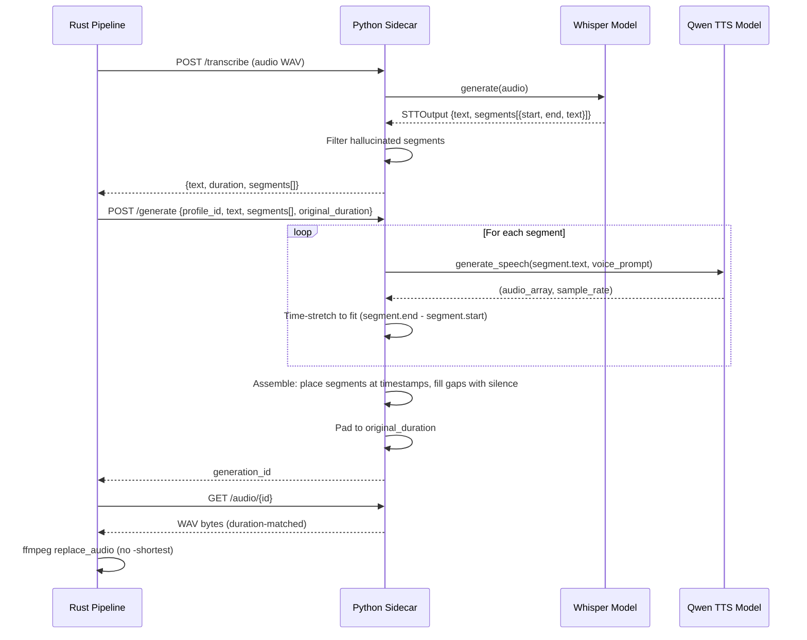

# feat: Timestamp-synced local TTS generation

## Overview

When using local TTS (Qwen via sidecar), generated voice audio ignores the timing of the original recording. Pauses, gaps, and pacing are lost because the pipeline discards Whisper's segment timestamps and generates one continuous audio stream from the full transcribed text. This plan adds timestamp-synchronized generation: each Whisper segment is generated independently, time-stretched to match its original duration, and placed at the correct position in the output audio with silence filling the gaps.

## Problem Frame

ElevenLabs cloud TTS does speech-to-speech (preserves timing naturally). Local TTS does text-to-speech (all timing is lost). If a user speaks for 10s, pauses 5s to demo something, then speaks for 10s more, the local TTS generates 20s of continuous speech — the voice is completely out of sync with the video content.

The irony is that Whisper already returns segment-level timestamps with start/end times. The current code at `tts.py:63` takes only `result.text` and discards `result.segments` entirely. The timing data exists — it's just thrown away.

Additionally, the ffmpeg `replace_audio` step uses `-shortest`, which truncates the video to the audio length — compounding the problem when TTS audio is shorter than the video.

## Requirements Trace

- R1. Whisper transcription must expose segment timestamps (start, end, text) to the pipeline
- R2. TTS generation must produce audio for each segment independently
- R3. Generated segments must be assembled at their original timestamps with silence gaps
- R4. Segments that differ significantly in duration from the original must be time-stretched to fit
- R5. Final audio must match the original recording duration exactly
- R6. The `-shortest` ffmpeg flag must be removed so video is not truncated
- R7. ElevenLabs (cloud S2S) path must continue to work unchanged
- R8. Backward compatibility: if no segments are present, `/generate` falls back to current behavior

## Scope Boundaries

- **In scope**: Python sidecar transcription + generation changes, Rust pipeline threading, ffmpeg flag fix, time-stretching
- **Out of scope**: ElevenLabs path changes, frontend UI changes, word-level timestamp alignment, sidecar Python unit tests (no existing test infrastructure to build on)
- **Out of scope**: Browser-side ffmpeg in `preview/+page.svelte` (separate concern, used for a different flow)

## Context & Research

### Relevant Code and Patterns

**Current data flow** (what changes are in parentheses):

```
Recording → Extract audio (16kHz WAV) → POST /transcribe
  → tts.py:transcribe() returns {text, duration} (ADD: segments[])
  → Rust parses TranscriptionResponse (ADD: segments field)
  → POST /generate {profile_id, text} (ADD: segments[], original_duration)
  → server.py _do_generate():
      split_text_into_chunks(text) → generate per chunk → crossfade concat
      (NEW: if segments present → generate per segment → time-stretch → assemble at timestamps)
  → Poll status → Download WAV
  → ffmpeg replace_audio with -shortest (REMOVE: -shortest)
```

**Whisper output structure** (from `mlx_audio.stt.models.whisper.whisper.py`):

The `_whisper_model.generate()` returns an `STTOutput` dataclass with `.segments` — a list of dicts:
```python
{"seek": int, "start": float, "end": float, "text": str,
 "tokens": list, "temperature": float, "avg_logprob": float,
 "compression_ratio": float, "no_speech_prob": float}
```

Only `start`, `end`, and `text` are needed. `no_speech_prob` and `compression_ratio` are used for filtering hallucinated segments.

**Existing patterns to follow**:
- `chunked_tts.py:concatenate_audio_chunks()` — crossfade-based audio concatenation (line 114-140)
- `chunked_tts.py:split_text_into_chunks()` — character-based chunking (line 30-63), still needed for sub-chunking long segments
- `server.py:_do_generate()` — generation queue worker pattern (line 274-332)
- `local_tts.rs:TranscriptionResponse` — serde struct pattern for sidecar responses (line 38-43)

**Key file paths**:
- `src-tauri/sidecar/tts.py` — transcription (line 38-82), TTS generation (line 190-223)
- `src-tauri/sidecar/server.py` — `/transcribe` (line 207-230), `/generate` (line 258-335)
- `src-tauri/sidecar/chunked_tts.py` — text chunking + audio concatenation
- `src-tauri/src/local_tts.rs` — `speech_to_speech()` (line 73-240), `TranscriptionResponse` (line 38-43)
- `src-tauri/src/ffmpeg.rs` — `replace_audio_args()` (line 26-31)
- `src-tauri/sidecar/requirements.txt` — Python dependencies
- `src-tauri/sidecar/voiceover-tts.spec` — PyInstaller bundle config

### External References

- **Whisper segment filtering**: `no_speech_prob > 0.6` and `compression_ratio > 2.4` are community-consensus thresholds for filtering hallucinated segments (from OpenAI Whisper discussions)
- **Time-stretching**: pyrubberband (wraps Rubber Band Library C++) is highest quality for speech; `crispness=6` is optimal for voice. Requires `rubberband` system binary
- **Audio assembly**: Pure NumPy with pre-allocated buffer at exact duration is the standard approach for sample-accurate placement — avoids pydub's millisecond-resolution limitation
- **Fade boundaries**: 5-10ms fade-in/fade-out at segment boundaries prevents audible clicks

## Key Technical Decisions

- **Modify `/generate` vs new endpoint**: Modify the existing `/generate` endpoint with optional `segments` parameter. When segments are absent, existing character-based chunking behavior is preserved (R8). Avoids API surface sprawl.

- **Assembly location**: All audio assembly happens in the Python sidecar, not Rust. The sidecar already has numpy/soundfile and handles all audio processing. Rust just threads the data through.

- **Time-stretching library**: pyrubberband as primary (best speech quality, `crispness=6`), librosa as fallback (already in PyInstaller spec at line 44). Dual approach handles the case where `rubberband` CLI binary isn't installed.

- **Stretch threshold**: Only time-stretch when TTS segment differs from original by >15%. Below that threshold, pad with silence or truncate with fade-out. Avoids unnecessary quality degradation for nearly-correct segments.

- **Stretch ratio clamping**: Clamp to 0.25x-4.0x range. Beyond that, audio quality degrades significantly. If a segment is >4x off, it's likely a Whisper segmentation error — better to pad/truncate than destroy the audio.

- **Duration source**: Use `soundfile.info().duration` for precise audio duration (already done at `tts.py:73-78`). Pass this `original_duration` from Rust to `/generate` so the assembly buffer is exactly the right length.

- **Sub-chunking within segments**: If a Whisper segment exceeds 800 chars (unlikely for natural speech but possible), sub-chunk it using existing `split_text_into_chunks()`, generate each sub-chunk, crossfade them together, then treat the combined result as the segment's audio for time-stretching and placement.

- **Segment filtering**: Filter out hallucinated Whisper segments using `no_speech_prob > 0.6` and `compression_ratio > 2.4`. Also discard segments with empty text. Fix overlapping timestamps by clamping.

- **`-shortest` removal scope**: Remove from `ffmpeg.rs:replace_audio_args()` only (affects Rust pipeline). The browser-side `-shortest` in `preview/+page.svelte:206` is a separate concern used for a different flow path (browser-based processing) and is out of scope.

## Open Questions

### Resolved During Planning

- **Segment vs word-level timestamps?** Segment-level. Word-level is inferred via Dynamic Time Warping on attention scores, can drift 100-500ms per word, and is unnecessary granularity for this use case. Segment-level (typically 1-30s chunks) aligns with natural speech pauses.

- **New Python module vs extend existing?** Extend `chunked_tts.py`. It already handles audio concatenation. The timed assembly functions are a more sophisticated concatenation. This avoids file sprawl and keeps audio assembly logic co-located.

- **Does the generation queue need changes?** No. The `_generation_worker` processes one job at a time. Per-segment generation happens sequentially within a single `_do_generate()` coroutine — same pattern as current per-chunk generation.

- **Sample rate handling?** Work at the TTS output sample rate throughout (likely 24kHz for Qwen3-TTS 12Hz codec). The assembly buffer and all segments use this rate. FFmpeg handles any final conversion when muxing with video.

### Deferred to Implementation

- **Exact Qwen TTS output sample rate**: Need to verify the actual `sample_rate` returned by `generate_speech()`. The plan assumes it's consistent across calls (safe assumption since it comes from the model's codec).

- **pyrubberband bundling**: Whether the `rubberband` CLI binary needs to be bundled in the PyInstaller spec or if the librosa fallback is sufficient for release builds. Testing will determine which path is needed.

## High-Level Technical Design

> *This illustrates the intended approach and is directional guidance for review, not implementation specification. The implementing agent should treat it as context, not code to reproduce.*



## Implementation Units

- [x] **Unit 1: Add time-stretching dependencies**

**Goal:** Add pyrubberband to the Python dependency chain with librosa as fallback.

**Requirements:** R4

**Dependencies:** None

**Files:**
- Modify: `src-tauri/sidecar/requirements.txt`
- Modify: `src-tauri/sidecar/voiceover-tts.spec` (if pyrubberband needs explicit bundling)

**Approach:**
- Add `pyrubberband>=0.4.0` to requirements.txt
- pyrubberband wraps the `rubberband` CLI binary — note that `brew install rubberband` is needed for development
- librosa is already referenced in the PyInstaller spec (line 44, 102) as a hidden import / collect_all target, so it's available as fallback without additional bundling work
- The time-stretch helper function should try pyrubberband first, fall back to librosa if the rubberband binary isn't found

**Patterns to follow:**
- Existing requirements.txt format (pinned versions)
- Existing PyInstaller spec `collect_all` pattern with try/except (line 44-51)

**Test scenarios:**
- `pip install -r requirements.txt` succeeds in the sidecar venv
- Import `pyrubberband` succeeds when rubberband is installed
- Import `librosa.effects` succeeds as fallback

**Verification:**
- requirements.txt installs cleanly in a fresh venv
- PyInstaller build completes without new missing-module errors

---

- [x] **Unit 2: Expose Whisper segment timestamps from transcription**

**Goal:** Return segment-level timestamps from `tts.py:transcribe()` so the pipeline has timing data.

**Requirements:** R1

**Dependencies:** None

**Files:**
- Modify: `src-tauri/sidecar/tts.py` — `transcribe()` function (line 38-82)

**Approach:**
- After the `result = _whisper_model.generate(str(audio_path))` call at line 55, extract `result.segments` (the `STTOutput.segments` attribute)
- Filter segments: remove entries with `no_speech_prob > 0.6`, `compression_ratio > 2.4`, or empty text
- Fix overlapping timestamps: clamp `segment[n+1].start = max(segment[n+1].start, segment[n].end)`
- Return only the needed fields per segment: `{start: float, end: float, text: str}`
- The return dict becomes `{"text": text, "duration": duration, "segments": [...]}`
- Handle the edge case where `result.segments` is None or the result type doesn't have segments (generator path at line 64-70) — in those cases, return an empty segments list and the pipeline falls back to unsynchronized generation

**Patterns to follow:**
- Existing `transcribe()` return dict pattern
- Existing duration calculation via `soundfile.info()` (line 73-78)

**Test scenarios:**
- Audio with clear speech returns segments with valid start/end times
- Audio with hallucinated segments (high no_speech_prob) has those segments filtered out
- Audio with no speech returns empty segments list
- Overlapping segment timestamps are clamped correctly
- Duration is precise (from soundfile, not estimated)

**Verification:**
- `POST /transcribe` response includes `segments` array with `start`, `end`, `text` fields
- Segments are ordered by start time with no overlaps
- Text concatenation of all segment texts approximately matches the full `text` field

---

- [x] **Unit 3: Add timed audio assembly functions**

**Goal:** Create the audio assembly and time-stretching utility functions that the `/generate` endpoint will use.

**Requirements:** R3, R4, R5

**Dependencies:** Unit 1

**Files:**
- Modify: `src-tauri/sidecar/chunked_tts.py` — add new functions

**Approach:**
- Add `time_stretch_segment(audio, sample_rate, rate)` function:
  - Try pyrubberband with `crispness=6` (best for speech)
  - Fall back to librosa.effects.time_stretch if rubberband binary not found
  - Clamp rate to 0.25-4.0 range
  - Skip stretching if rate is within 1% of 1.0
- Add `assemble_timed_segments(tts_segments, original_duration, sample_rate)` function:
  - Pre-allocate numpy zeros buffer of length `int(original_duration * sample_rate)`
  - For each (audio, start_sec, end_sec) tuple: compute target duration, time-stretch if >15% difference from target, else pad/truncate
  - Place each segment at `int(start_sec * sample_rate)` in the output buffer with bounds checking
  - Apply 5ms fade-in/fade-out at each segment's boundaries to prevent clicks
  - Return the complete assembled audio array
- Add `apply_fade(audio, sample_rate, fade_ms=5)` helper for boundary smoothing

**Patterns to follow:**
- Existing `concatenate_audio_chunks()` function structure and crossfade pattern (line 114-140)
- NumPy float32 arrays throughout (consistent with existing code)

**Test scenarios:**
- Two segments with a 5s gap produce audio with silence in the gap
- Segment shorter than target duration is time-stretched to fit
- Segment longer than target duration is compressed to fit
- Segment within 15% of target duration is padded/truncated (not stretched)
- Output buffer length exactly matches `int(original_duration * sample_rate)`
- Fade-in/fade-out applied without clipping at boundaries
- Empty segments list produces all-silence buffer of correct duration
- Segment that would extend past buffer end is truncated to fit

**Verification:**
- Assembly produces a numpy array of exactly the expected sample count
- Silence regions contain zeros
- No clicks or discontinuities at segment boundaries (fade applied)

---

- [x] **Unit 4: Modify /generate endpoint for segment-aware generation**

**Goal:** When segments are provided, generate TTS per-segment, time-stretch each to match original duration, and assemble at original timestamps.

**Requirements:** R2, R3, R4, R5, R8

**Dependencies:** Unit 2, Unit 3

**Files:**
- Modify: `src-tauri/sidecar/server.py` — `/generate` endpoint and `_do_generate()` inner function (line 258-335)

**Approach:**
- Add optional `segments` and `original_duration` fields to the `/generate` request parsing (line 261-263)
- In `_do_generate()`, branch on whether `segments` is present and non-empty:
  - **With segments (new path)**: iterate segments, generate TTS per segment (using existing `generate_speech()`). If a segment's text exceeds 800 chars, sub-chunk it with `split_text_into_chunks()`, generate per sub-chunk, and crossfade-concatenate the sub-chunks first. Collect all (audio, start, end) tuples. Call `assemble_timed_segments()` to produce final audio.
  - **Without segments (existing path)**: unchanged behavior — split by chars, generate, crossfade concat (R8 backward compatibility)
- Voice prompt preparation (model loading, sample fetching, prompt creation) is shared between both paths — no duplication
- Generation progress logging should indicate segment index (e.g., "generating segment 3/12")

**Patterns to follow:**
- Existing `_do_generate()` chunked generation loop (line 306-322)
- Existing generation status updates pattern (line 290, 299, 305)
- Existing `sf.write()` for saving output (line 330)

**Test scenarios:**
- `/generate` with segments produces audio matching original duration
- `/generate` without segments produces same behavior as before (backward compat)
- Long segment (>800 chars) is sub-chunked within the segment
- Generation status updates reflect segment progress
- Single-segment recording generates correctly
- Many-segment recording (20+) generates without issues

**Verification:**
- Generated WAV file duration matches `original_duration` parameter
- Audio contains speech at expected timestamps and silence in gaps
- Generation queue continues to serialize GPU work (no contention)

---

- [x] **Unit 5: Thread segments through Rust pipeline**

**Goal:** Update the Rust `speech_to_speech()` function to parse segments from transcription and forward them to `/generate`.

**Requirements:** R1, R2, R7

**Dependencies:** Unit 2, Unit 4

**Files:**
- Modify: `src-tauri/src/local_tts.rs` — `TranscriptionResponse` struct (line 38-43), `speech_to_speech()` function (line 73-240)
- Test: `src-tauri/src/local_tts.rs` — existing test module (line 449-506)

**Approach:**
- Add a `TranscriptionSegment` struct with `start: f64`, `end: f64`, `text: String`
- Add `segments: Vec<TranscriptionSegment>` to `TranscriptionResponse` (with `#[serde(default)]` for backward compat with older sidecar versions)
- In `speech_to_speech()` step 2 (line 134-139), include `segments` and `duration` (as `original_duration`) in the `/generate` JSON body
- Remove `#[allow(dead_code)]` from `duration` field since it's now used
- The ElevenLabs path in `pipeline.rs` is unaffected — it calls `elevenlabs::speech_to_speech()` directly, not this function (R7)

**Patterns to follow:**
- Existing serde struct patterns with `#[serde(default)]` (see `LocalVoice` line 15-21)
- Existing JSON body construction pattern (line 135-139)

**Test scenarios:**
- `TranscriptionResponse` deserializes with segments present
- `TranscriptionResponse` deserializes with segments absent (backward compat, defaults to empty vec)
- `TranscriptionSegment` deserializes correctly from JSON
- Generate request body includes segments and original_duration when segments are non-empty

**Verification:**
- `cargo test` passes with updated structs
- Deserialization handles both old (no segments) and new (with segments) response formats
- The ElevenLabs code path is completely unmodified

---

- [x] **Unit 6: Remove -shortest from ffmpeg replace_audio**

**Goal:** Stop truncating video to audio length, since audio will now match video duration.

**Requirements:** R6

**Dependencies:** None (can be done in parallel with other units, but should be deployed together)

**Files:**
- Modify: `src-tauri/src/ffmpeg.rs` — `replace_audio_args()` (line 26-31)
- Test: `src-tauri/src/ffmpeg.rs` — existing test module (line 103-167)

**Approach:**
- Remove `"-shortest"` from the args array in `replace_audio_args()` (line 29)
- This is safe because:
  - Local TTS path: audio will now be assembled to match original duration exactly
  - ElevenLabs S2S path: speech-to-speech preserves original timing, so audio naturally matches video duration
- No existing test checks for the presence of `-shortest`, so no test needs updating for the removal
- Consider adding a test that verifies `-shortest` is NOT in the args (documents the intentional removal)

**Patterns to follow:**
- Existing test pattern in `ffmpeg.rs` (assertion-based arg checking)

**Test scenarios:**
- `replace_audio_args()` does not include `-shortest` in returned args
- All other args remain unchanged (video mapping, codec, padding)

**Verification:**
- `cargo test` passes
- Existing `replace_audio_args` tests still pass
- New test confirms `-shortest` is absent

## System-Wide Impact

- **Interaction graph**: The change is contained within the `local_tts.rs → sidecar server.py → tts.py/chunked_tts.py` path. No callbacks, middleware, or observers are affected. The pipeline.rs orchestrator is unmodified — it just calls `speech_to_speech()` as before.
- **Error propagation**: If segment-aware generation fails, the sidecar returns the same error format through the generation status endpoint. No new error paths are introduced at the Rust or frontend level.
- **State lifecycle risks**: The generation queue serializes all GPU work. Per-segment generation runs within a single queue job, so no concurrency issues. Audio buffers are in-memory numpy arrays, freed when the generation function completes.
- **API surface parity**: The frontend never calls the sidecar directly (all routes through Rust IPC commands). No frontend API changes needed. The sidecar `/generate` endpoint is backward compatible (segments are optional).
- **Integration coverage**: End-to-end testing requires a real recording processed through the full pipeline. The test plan in the todo.md describes the manual verification: record 10s speech → 5s silence → 10s speech, verify output is 25s with correct timing.

## Risks & Dependencies

- **pyrubberband requires rubberband system binary**: `brew install rubberband` needed for development. The librosa fallback ensures the feature works even without it, but with slightly lower stretch quality. PyInstaller bundling of the rubberband binary may need investigation during implementation.
- **Whisper segment quality varies**: Hallucinated segments, especially in quiet sections, could produce unexpected TTS. The filtering (no_speech_prob, compression_ratio) mitigates this, but edge cases may surface in testing.
- **TTS generation time increases**: Generating per-segment instead of per-text-chunk may increase total generation time due to model warm-up overhead per call. However, the existing `generate_speech()` function already handles this efficiently, and the GPU is already serialized.
- **Large recordings (30+ minutes)**: Many segments could mean many sequential TTS calls. Performance may degrade. Consider logging per-segment timing to identify bottlenecks during testing.

## Sources & References

- Related code: `src-tauri/sidecar/tts.py:55` — where segments are currently discarded
- Related code: `src-tauri/src/local_tts.rs:38-43` — TranscriptionResponse struct
- Related code: `src-tauri/src/ffmpeg.rs:26-31` — replace_audio_args with -shortest
- Related code: `src-tauri/sidecar/chunked_tts.py:114-140` — existing crossfade concatenation
- mlx-audio STTOutput: `.sidecar-venv/lib/python3.14/site-packages/mlx_audio/stt/models/whisper/whisper.py` line 262 (STTOutput dataclass with segments field)
- OpenAI Whisper discussions: segment hallucination filtering thresholds (no_speech_prob > 0.6, compression_ratio > 2.4)
- pyrubberband: Python wrapper for Rubber Band Library (C++ time-stretching engine)
- Todo reference: `.notes/todo.md` item #1
